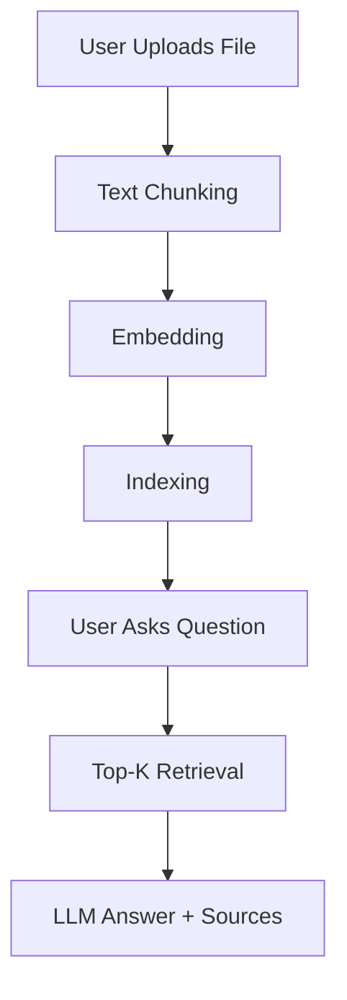

# 🧠 Agentic RAG Chatbot

[](https://github.com/AmanDataverse/Agentic_RAG_chatbot)
[](LICENSE)
[](https://www.python.org/)
[]()

A multi-format, document-based **Retrieval-Augmented Generation (RAG)** chatbot enhanced with a modular **agentic architecture** and **Model Communication Protocol (MCP)**. Developed to demonstrate proficiency in real-world AI tooling, scalable system design, and intelligent QA workflows for enterprise use cases.

---

## 📌 Problem Statement

Organizations deal with large volumes of unstructured documents. Extracting knowledge from such formats often requires contextual understanding, not just keyword search. This system enables natural language querying over documents of varied formats using LLMs, retrieval systems, and modular agents.

---

## 🚀 Key Features

✅ Upload PDFs, DOCX, PPTX, TXT, CSV, Markdown  
✅ Agent-based architecture: Ingestion, Retrieval, and LLM Response  
✅ FAISS-based similarity search  
✅ Real-time Q&A using Streamlit chatbot UI  
✅ Displays **retrieved chunks** for transparency  
✅ Modular, testable, and extensible codebase  
✅ Supports OpenAI / Groq APIs

---

## 🧰 Tech Stack

| Layer           | Technology                              |
|-----------------|------------------------------------------|
| UI              | `Streamlit`                              |
| Backend         | `Python` (OOP-based modular agents)      |
| Embeddings      | `SentenceTransformers (MiniLM-L6-v2)`    |
| Vector Database | `FAISS`                                  |
| LLM APIs        | `OpenAI`, `Groq`                         |
| Document Parsing| `PyMuPDF`, `python-docx`, `python-pptx`  |

---

## 📊 Workflow




```markdown
## 📁 Project Structure

```text
agentic_rag_chatbot/
│
├── agents/                 # Ingestion, retrieval, and response logic
│   ├── ingestion_agent.py
│   ├── retrieval_agent.py
│   └── llm_response_agent.py
│
├── data/                   # Uploaded files
├── db/                     # FAISS index and pickled documents
├── ui/                     # Streamlit interface
├── utils/                  # Utility functions (e.g., MCP)
│
├── .env                    # API keys and credentials
├── requirements.txt        # Python dependencies
├── README.md               # Documentation
└── .gitignore              # Git ignore file
